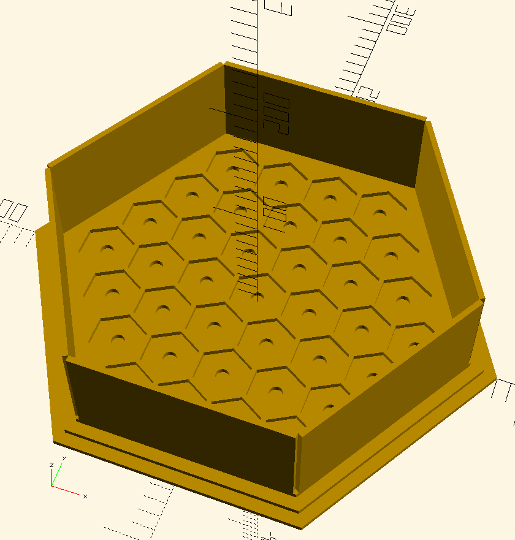
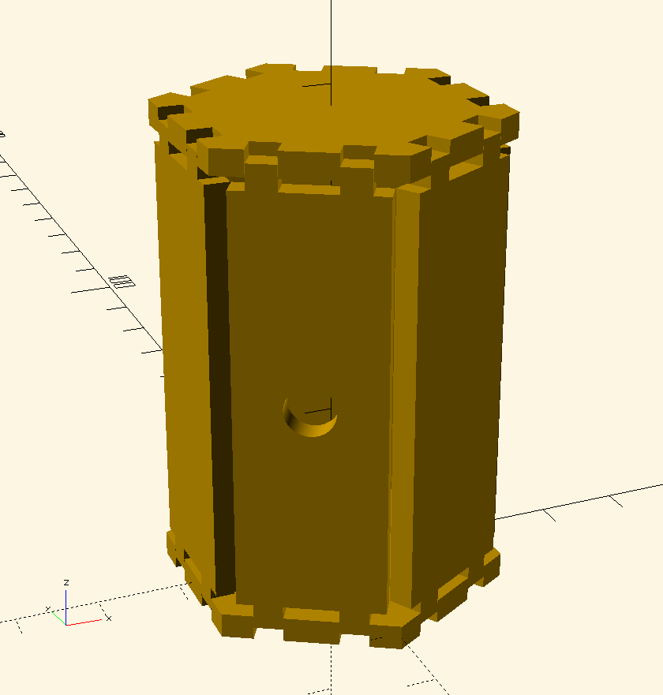
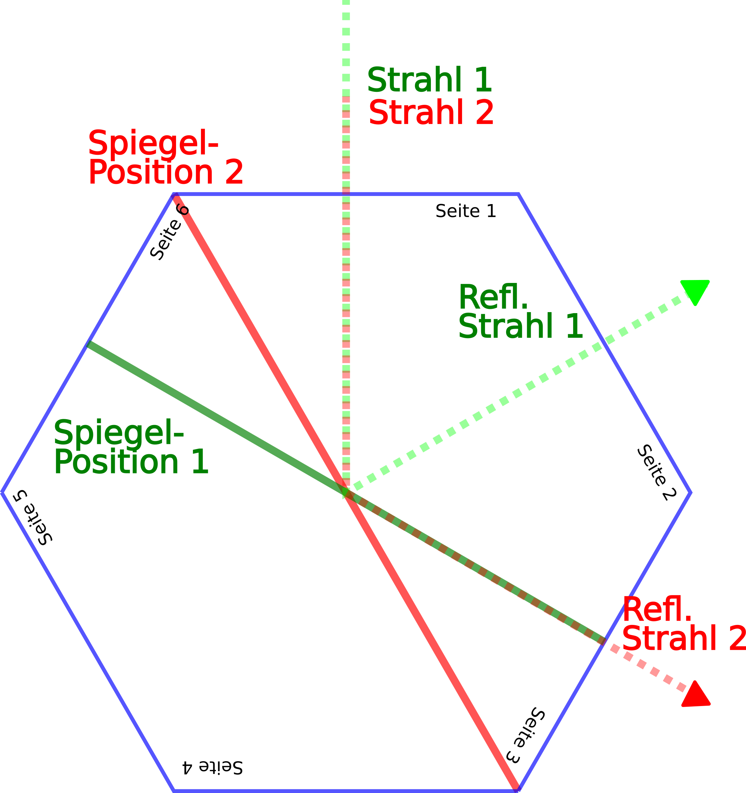

# LaserLabyrinth

LaserLabyrinth ist ein Knobbelspiel, bei dem  logisches Denken und räumliches Vorstellungsvermögen im Vordergrund stehen. Der Grundgedanke dieses Spiels ist es einen Laserstrahl mithilfe von Spiegeln geschickt an Hindernissen vorbei auf das Ziel umgeleitet werden.

## Wie funktioniert das Ganze?

Das Spielfeld ist ein Sechseck, das wiederum aus sechseckigen Feldern besteht.
In diese Felder können die Spielfiguren eingesetzt werden.
Die sechseckige Feldform erlaubt es die Spielfiguren in sechs verschiedenen Orientierungen
einzusetzen und erlaubt damit mehr Freiraum als ein quadratisches Spielfeld.

{width=14cm}

Die wichtigste Spielfigur ist der Tower, der auf Knopfdruck einen Laserstrahl aussenden kann.
Ebenso wichtig ist das Ziel, das den Laserstrahl empfangen und einen Treffer anzeigen kann. (TODO: Namen Spielfiguren??)

{width=14cm}

Damit der Strahl auch ins Ziel gelangen kann gibt es Spiegelfiguren, die den Strahl umlenken.
Um das Spiel anspruchsvoller zu gestalten können an strategischen Stellen Feld- oder Richtungsblocker eingesetzt werden um ein Feld zu blockieren oder nur ein bestimmte Strahlrichtung zu erlauben.
Ein Strahlteiler, der einen Teil des einfallenden Lichts durchlässt während der andere Teil reflektiert wird, erlaubt Konstellationen mit mehreren Zielen.

{width=14cm}

## Die Physik dahinter
Das wichtigste Prinzip hinter dem LaserLabyrinth ist, das Reflexionsgesetz. 
Der Einfallswinkel des Laserstrahls auf den Spiegel entspricht dem Ausfallswinkel des Strahls.
Der Laserstrahl trifft immer senkrecht auf eine Sechseckseite. Wenn man sich dies geschickt zu Nutze macht, kann man den Spiegel so positionieren, dass der eintretende Laserstrahl durch eine beliebige Seite austritt.

{width=14cm}

Konkret braucht man nur 2 verschiedene Spiegelpositionen um den Strahl auf eine der vier schräg gelegenen
Seiten umzulenken. In der Zeichnung fällt der Strahl über Seite 1 ein und tritt je nach Spiegelposition durch Seite 2 oder Seite 3 aus. Durch Drehen der Spielfigur ist es möglich den Strahl durch Seite 5 bzw. Seite 6 zu lenken. Ohne Spiegel verlässt der Strahl das Sechseck über die Seite 4

## Die Elektronik dahinter
Das Gehirn des Ganzen bildet ein kleiner Mikrocontroller/Arduino, der im Tower und Ziel steckt. Mithilfe dessen wird der Laserstrahl kontrolliert gesendet und empfangen. Wie in Abbildung 1 angedeutet wird der Laserstrahl über eine PWM moduliert. D.h. es ist kein kontinuierlicher Strahl sondern der Strahl wird sehr oft an- und ausgeschaltet. Dies geschieht in Frequenzen, die das Auge nicht wahrnehmen kann und für einen Menschen wirkt es wie ein kontinuierlicher Strahl nur mit schwächerer Intensität. Sinn des Ganzen ist es verschiedene Laserquellen mit unterschiedlichen PWM-Frequenzen zu verwenden. Dadurch können Ziele auf eine bestimmte Laserquelle eingestellt werden und werden nur durch diese aktiviert! Gleichzeitig kann so der Laserstrahl vom Umgebungslicht unterschieden werden, bzw. das Ziel kann nicht von einer Fremdlichtquelle aktiviert werden.

## Sicherheit
Als Laserdioden werden so genannte "eye safe" Laser verwendet. Dennoch werden weitere Vorsichtsmaßnahmen getroffen. So werden die Spielfiguren nur mit Strom versorgt, wenn sie in das Spielfeld gesteckt werden. Gleichzeitig sind alle Figuren und das Spielfeld von Seitenwänden umgeben (s. Abbildungen unten). Der Laserstrahl kann nur an bestimmten Öffnungen an den Seitenwänden austreten, was es praktisch unmöglich machen sollte unbeabsichtigt in den Laserstrahl zu schauen.

## Lernziele

- Sicherer Umgang mit Lasern.
- Wie verhält sich ein Laser (ein gebündelter Lichtstrahl) wenn er auf eine reflektierende Oberfläche trifft, Einfallswinkel = Ausfallswinkel
- Licht ist "lenkbar", man kann es mit Spiegeln nahezu beliebig umleiten
- Licht kann Informationen übermitteln (PWM-modulierter Strahl löst nur manche Ziele aus)
